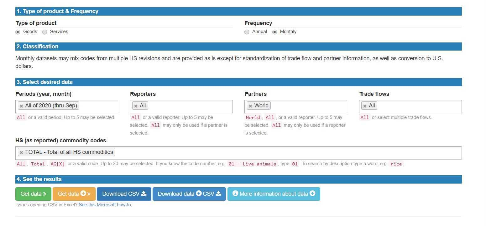

# UN-Comtrade

This dataset was explored and mined together with 3 other group members during the duration of a distributed data mining course at TUM. Each group member was allowed the creative freedom of exploring the dataset alone before discussion in the group and results were presented to the professor weekly.

Link to the dataset: https://comtrade.un.org/data/



## Configuration

- A **virtual environment** of some kind
- Python Version 3.7.9

### Creating a virtual environment

On Windows, you have to launch the following command in Powershell or Cmd to
create a virtual environment:
```
python3 -m venv ./venv
```

This will create a folder `./venv` in the current folder. This folder will contain
an instance of *Python3* and *Pip* that will be used to install all the necessary
stuff for this project, without the need for polluting your global python environment.

However, the virtual environment is not active by default.In VSCode, after you
install the virtual environment, every time you open a new terminal window, it
will automatically (hopefully) activate the virtual environment for you.

If it doesn't do it, on Powershell or Cmd you have to launch:
```
\env\Scripts\activate.bat
```

This will allow you to use the virtual environment in your current terminal
session. From this point on, every `python` or `pip` command will be executed
using the python binaries in the `venv` folder.

### Installing requirements

After installing the virtual environment and activating it, it's time to install
all the dependencies required for this project. To do this, there's a `requirements.txt`
file that lists all dependencies needed. Of course, you don't have to install them
by hand.

To install the requirements, you have to launch:
```
pip install -r requirements.txt
```
This will automatically install and update your dependencies in your virtual
environment. **Please, run this every time you pull from master!**

## Creating a Python Notebook

To use the scripts that have been preconfigured, these are the first lines that
you have to include in your very first cell of your notebook:

```{python}
import os, sys
currentdir = os.path.dirname(os.path.realpath(os.path.abspath("")))
scriptsdir = os.path.dirname(currentdir)
if scriptsdir not in sys.path:
    sys.path.append(scriptsdir)

from customscripts import configuration
from customscripts import utils

# Common imports

import numpy as np
import scipy as sp
import pandas as pd
import seaborn as sns
import matplotlib.pyplot as plt
```


## Project structure

```
.
├── dataset 
├── docs   
├── scripts # The scripts to generate or read files and dataframes will be here, and can be imported from any notebook
├── week1   # Every week's work
│   ├── abi # my contribution to the data mining work
│   └── unified # unified notebook  of chosen solution with other group members
├── week2
│   ├── abi
│   └── unified
├── week3
│   ├── abi
│   └── abi
├── week4
│   └── abi
├── week5
│   └── abi
├── week6
│   └── abi
```
Note: A considerable amount of the creative curation of this ReadMe can be credited to group member Adrian Castro
